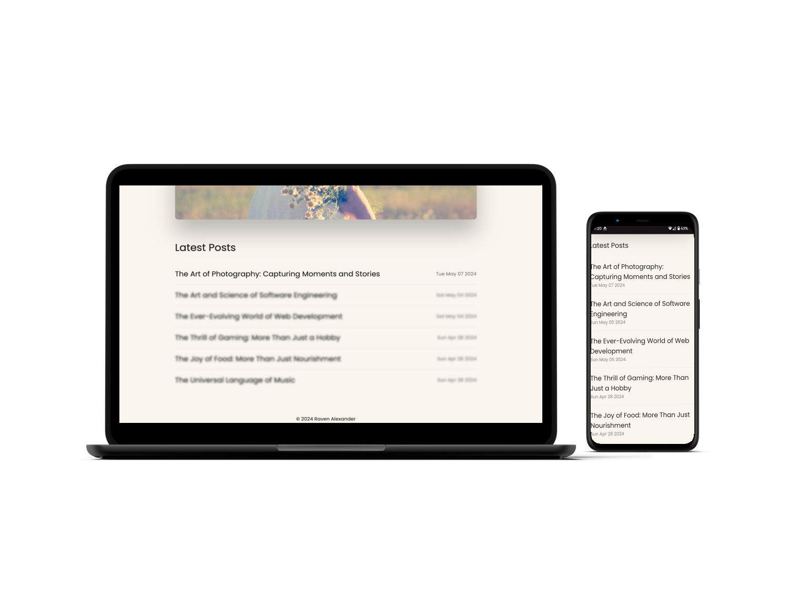

# BlogMate Web Blog

This project is a full-stack web page built with NodeJS and Express using a MongoDB database. The blog posts are part of a database collection that can be added to, edited, deleted from, etc. There is a Posts collection, a Users collection, a Comments collection and a Sessions collection within the database.

Live (deployed) Site: [BlogMate](https://sba-mongodb-1.onrender.com/)

## Project Objectives 
The primary goal of this project was to enhance understanding and proficiency in several key areas of web development:

- **NodeJS Proficiency** - Create a server application with Node, Express, and MongoDB.
- **CRUD API Creation** - Create a CRUD API using Express and MongoDB.
- **MongoDB Indexing** - Create MongoDB indexes and use indexing to make efficient queries.
- **MongoDB Validation** - Create MongoDB validation rules and use validation to ensure data consistency.

## Features
1. **Search Bar** - Search functionality is made possible to be able to find keywords within blog posts.
2. **Admin Dashboard** - Dashboard allows you to create, edit and delete blog posts from the database.
3. **User Authentication** - Implemented JWT Authentication with BCrypt to ensure secure and reliable user login and registration processes.
4. **Responsive Website** - Utilize media-queries to create visually appealing and user-friendly interactions.

## Languages and Technologies Used
- HTML
- CSS
- JS
- NodeJS
- Express
- Mongoose
- MongoDB
- EJS (view engine)

## Installation
To run this app locally, you must install these dependencies:
`npm i bcrypt connect-mongo cookie-parser dotenv ejs express express-ejs-layouts express-session jsonwebtoken method-override mongoose body-parser`

Run `node app.js` to start the server and view page in browser.

## Important:
You MUST register/login to access the dashboard for testing. I recommend creating a very simple username and password to test the functionality. If you forget your password, I can't help you. ;D

| Admin Login | Admin Dashboard |
| ------------- | ------------- |
|  |  |
| Add New Post | Edit Post |
|  |  |

## API Route Examples

### **Admin Management**

### **1. Add Blog Post**

- **Endpoint:** **`POST /add-post`**
- **Description:** Creates a new blog post

### **2. Read Blog Post**

- **Endpoint:** **`GET /post:id`**
- **Description:** Fetches a blog post from the database entries.

### **3. Edit Blog Post**

- **Endpoint:**  **`PUT /edit-post:id`**
- **Description:** Allows you to edit a specific post by id number.

### **4. Delete Blog Post**

- **Endpoint:**  **`DELETE /delete-post:id`**
- **Description:** Allows you to delete a specific post by id number.

## Challenges Addressed

1. **View Engines**: Using Express view engines was a new territory for me, and took a bit of a learning curve to get EJS right. But once I got the hang of it, it became easier!
2. **User Profile Creation**: I adapted a seamless profile creation for users as well as middleware to check if a user is logged in or not. This ensures all necessary information is captured and easily manageable.

## Future Goals

As of right now it is not possible to add additional images to a blog post from the client-side. I would love to be able to implement that in the future.